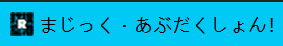
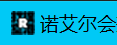
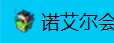

# RPG Maker MV 游戏图标错误及其解决方法

有些时候当你打开一个RPG Maker MV的游戏的时候，你可能会发现其窗口图标不正确。游戏的窗口图标是你玩的上一个RPG Maker MV游戏的图标。本文将尝试解释这个现象的原理及其解决方法。

* [直接看解决方法](#解决方法)

# 原理解释

RPG Maker MV 引擎是基于 [nw.js](https://docs.nwjs.io/en/latest/) 制作的。nw.js 会将用户数据储存在一个 "[chromium用户数据文件夹](https://chromium.googlesource.com/chromium/src/+/master/docs/user_data_dir.md)" 里面。

大概长这样:

```
└─User Data
    ├─BrowserMetrics
    ├─Crashpad
    ├─Default
    │  ├─blob_storage
    │  │  └─01234567-89ab-cdef-0123-456789abcdef
    │  ├─data_reduction_proxy_leveldb
    │  ├─Download Service
    │  │  ├─EntryDB
    │  │  └─Files
    │  ├─Extension Rules
    │  ├─Extension State
    │  ├─GPUCache
    │  ├─Sync Data
    │  │  └─LevelDB
    │  ├─Thumbnails
    │  └─Web Applications
    │      └─_crx_icogdcdnbgpilfoaafhjhpjmenlfjnnp
    ├─ShaderCache
    │  └─GPUCache
    └─Stability
```

nw.js 要求每一个软件使用一个 `package.json` 文件来描述当前软件。

根据[nw.js的文档](https://docs.nwjs.io/en/latest/References/Manifest%20Format/#name)，每一个 `package.json` 文件都必须要有两对键值:  `main` 和 `name` 。我们重点看 `name`:

> **nw.js文档:**
>
> **name**
>
> * {String} the name of the package. This must be a unique, lowercase alpha-numeric name without spaces. It may include “.” or “_” or “-” characters. It is otherwise opaque.
> 
> **name should be globally unique since NW.js will store app’s data under the directory named name.**

注意看最后一段话，`name` 必须是一个**全局独一无二的字符串**，因为nw.js会根据 `name` 的值来创建一个chromium用户数据文件夹用于储存软件的数据。

RPG Maker MV 引擎在Windows下会将所有的游戏的chromium用户数据文件夹放在下面这个路径下:

```
%USERPROFILE%\AppData\Local
```

如果一个游戏的 `name` 值为 `testgame` 那么其chromium用户数据文件夹将会在这个路径下: 

```
%USERPROFILE%\AppData\Local\testgame\User Data
```

RPG Maker MV 游戏有两个重要的 `package.json` 文件，一个为游戏根目录下的 `package.json`，另一个为游戏文件夹 `www` 下的 `package.json`。前者指向后者。两个 `package.json` 的 `name` 值必须相同。

如果两个 `package.json` 没有设置一个独一无二的 `name` 值

```jsonc
// 例如
{
    "name": "", // 不填写任何字符
}
```

那么，nw.js将会把chromium用户数据文件夹设置在下面这个路径上:

```
%USERPROFILE%\AppData\Local\User Data
```

RPG Maker MV 会在游戏运行时将游戏的窗口图标给缓存到游戏的chromium用户数据文件夹里（在文件夹 `Web Applications` 里面）。

当两个游戏的chromium用户数据文件夹位置相同，它们会使用同一个缓存的窗口图标。

# 例子

1. 我先打开游戏A，看到其窗口图标。



* 游戏A图标文件:


* 游戏A `package.json`:

```jsonc
// package.json
{
    "name": "",
    "main": "www/index.html",
    "js-flags": "--expose-gc",
    "window": {
        "title": "",
        "toolbar": false,
        "width": 816,
        "height": 624,
        "icon": "www/icon/icon.png"
    }
}

// www/package.json
{
    "name": "",
    "main": "index.html",
    "js-flags": "--expose-gc",
    "window": {
        "title": "",
        "toolbar": false,
        "width": 816,
        "height": 624,
        "icon": "icon/icon.png"
    }
}
```

* 我们可以看到游戏A的两个 `package.json` 文件都没有设置一个独一无二的 `name` 值，不过游戏A可以正确的显示图标。
* 此时，游戏A的chromium用户数据文件夹在下面这个路径上:

```
%USERPROFILE%\AppData\Local\User Data
```

2. 我们接着打开游戏B



* 游戏B图标文件:


* 游戏B `package.json`:

```jsonc
// package.json
{
    "name": "",
    "main": "www/index.html",
    "js-flags": "--expose-gc",
    "window": {
        "title": "",
        "toolbar": false,
        "width": 816,
        "height": 624,
        "icon": "www/icon/icon.png"
    }
}

// www/package.json
{
    "name": "",
    "main": "index.html",
    "js-flags": "--expose-gc",
    "window": {
        "title": "",
        "toolbar": false,
        "width": 816,
        "height": 624,
        "icon": "icon/icon.png"
    }
}
```

此时，游戏B的图标为游戏A的图标。引擎使用了之前缓存在游戏A的chromium用户数据文件夹下的游戏A的图标，游戏B窗口图标错误。

# 解决方法

* 这些方法应该是可以作用于RPG Maker MZ的游戏的，MZ和MV都是基于nw.js做的。

## 方法1：修改游戏 `package.json`：

如果我们为游戏B的两个 `package.json` 填上一个名字，游戏B就可以加载正确的图标。

```jsonc
// package.json
{
    "name": "same random name",
    "main": "www/index.html",
    "js-flags": "--expose-gc",
    "window": {
        "title": "",
        "toolbar": false,
        "width": 816,
        "height": 624,
        "icon": "www/icon/icon.png"
    }
}

// www/package.json
{
    "name": "same random name",
    "main": "index.html",
    "js-flags": "--expose-gc",
    "window": {
        "title": "",
        "toolbar": false,
        "width": 816,
        "height": 624,
        "icon": "icon/icon.png"
    }
}
```

* **请注意，两个 `package.json` 必须有相同的 `name` 值。**



* 我们可以看到现在游戏B的窗口图标变为正确的图标了。

## 方法2：清理chromium用户数据文件夹缓存的图标：

如果你不想更改游戏文件，你也可以清理chromium用户数据文件夹缓存的图标。

一般来说，大多数出现此问题的游戏都是没有设置 `name` 值的游戏。

它们的chromium用户数据文件夹在这个路径:

```
%USERPROFILE%\AppData\Local\User Data\Default
```

游戏窗口图标将被存在两个文件和一个文件夹下

* 所有图标的sqite3数据库 `Favicons`
* 所有图标的sqite3数据库档案文件 `Favicons-journal`
* 图标文件在文件夹 `Web Applications` 下面

只需要删除这两个文件和一个文件夹，就可以强行使游戏读取其自身的图标。

请注意：如果新游戏的 `package.json` 还是没有设置一个独一无二的 `name`，那么游戏引擎会将新游戏的图标给缓存到上述文件夹下。

我写的 Powershell Script [RPGMakerMV-icon-cleaner.ps1](./RPGMakerMV-icon-cleaner.ps1) 可以自动寻找图标缓存文件并删除。直接用Powershell运行就行了。


